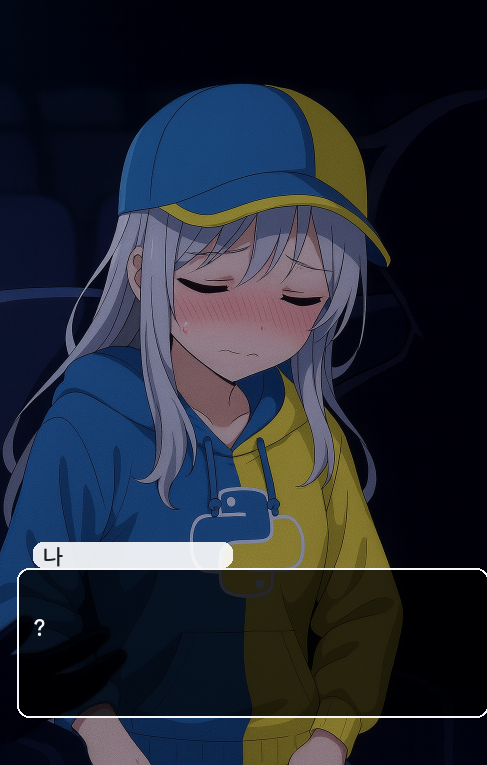
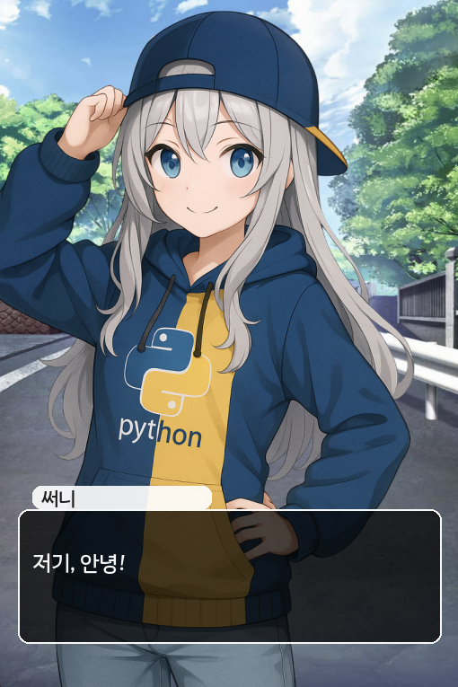

 
 
 
 
 
 
 

   
  <b>2팀 - 도키도키 파이썬!</b>

   
 
 
 
 
 
 

# 스크린샷

# 프로젝트 개요
### 팀원 소개
#### [이건우(팀장)](https://github.com/4vpr)
> 게임개발 경력이 다수 있습니다. 개인 프로젝트만 진행 해왔으며, 파이썬 언어와 깃허브를 사용한 협업은 처음입니다.  
> 프로젝트의 'API 클래스' '이벤트 핸들링' '랜더링'을 구축합니다.  
> 코딩에 익숙하지 않은 팀원들을 위한 게임 뼈대 설계를 하였습니다. 게임의 씬들을 파이썬의 print() input() 같은 명령어와 유사하게 작성 가능하여 팀원들이 파이썬 기초 문법과 친숙 해 질 수 있습니다.
> scenes 폴더의 Scene 인스턴스들 구조를 본다면 까암짝 놀랄지도?  
> 열심히 따라와준 팀원분들에게 무한 감사 ㅎㅎ  
#### [강현정](https://github.com/aooe120-maker)
> 프로젝트 아이디어를 제공했습니다  
> 간단한 함수들로 파이썬의 기본 문법을 다뤄 볼 수 있었습니다  
#### [최재흥](https://github.com/Lukascruise)
> 코딩의 모든것을 처음 다뤄봅니다. 파이썬과 깃허브를 통해 좋은팀원들과 작업해보게되어 즐거웠습니다  
> 프로젝트의 씬두개를 담당했고 일러스트를 위주로 많이 다뤄본것같습니다.  
> 좋은경험이 된거같아 감사했습니다.  

### 프로젝트 방향성
> 짧은 시간내에 개발 할 수 있는 다이얼로그 형식의 게임을 구현합니다.  
> pygame 라이브러리를 사용하는 순수 파이썬 프로젝트입니다.  
> 게임로직을 main으로 구현 후 브랜치를 나누어 씬을 개발 한 뒤 main으로 머지합니다.  
> 플레이하며 파이썬을 학습 할 수 있습니다.  
> 이미지는 생성형 이미지 / 직접 찾아온 이미지들을 사용하였습니다.  
# 게임 개요
- 흔히 아는 연애 시뮬레이션 게임이... 맞습니다!
- 호감도에 따른 엔딩이 다릅니다! 파이썬 공부를 열심히 하셨다면 해피엔딩 가능할지도?
- 엔딩은 일반엔딩 3개 히든엔딩 2개 진엔딩 1개로 구성되어 있습니다!
- 파이썬과 관련된 질문을 하니 준비 단단히 하시길...
### 릴리즈

[게임 다운로드](https://github.com/aooe120-maker/PROJECT-2/releases/tag/0.1)

## 추가) 소스코드에서 직접 씬을 추가해보자!
### 씬 새로 만들기
- scenes 폴더 안에 template.py (혹은 testscene.py) 파일을 복사하고 이름을 적절하게 지어주세요 예) 카페데이트라면: cafe.py
- 씬 정보를 알맞게 수정해주시고 script를 지운 후 새로 작성해주세요!

### 테스트 하는법
- vsc에서 main.py를 열어주세요.  
- F5를 눌러서 실행 해주세요.  
- F2를 눌러 디버그 모드에서 새로 만든 씬을 테스트 해볼 수 있습니다.  

### 구현된 함수,변수 목록
> #### 함수
> `game.p("내용")` 내용을 "써니의 대사"로 출력합니다  
> `game.me("내용")` 내용을 "플레이어의 대사"로 출력합니다  
> `game.other("내용", "이름")` 이름의 대사로 출력합니다! 예: game.other("밥먹어라","엄마")  
> `game.sel("선택지1","선택지2","선택지3" ...)` 선택지를 만듭니다.  
> `game.end()` 씬을 종료하는 함수입니다! 씬에 반드시 들어가야하며 여러 분기를 구현 할 수 있습니다.  
> `game.img("이미지 경로")` 화면에 보이는 "캐릭터의 이미지"를 변경합니다.  
> `game.background("이미지 경로")` "배경의 이미지" 를 변경합니다.  
> `game.fade_out()` 배경을 어둡게 전환합니다.  
> `game.fade_in()` 배경을 밝게 전환합니다.  

> #### 변수
> `game.like` 호감도 입니다  
> `game.choice` 이전에 고른 선택지의 인덱스값 입니다(1부터 시작)  
> `game.is_couple` 사귀는 사이인지에 대한 bool 값 입니다  
> `game.stage` 게임의 스테이지값입니다! 게임의 스테이지와 씬의 스테이지가 일치해야 입장 가능합니다.  
